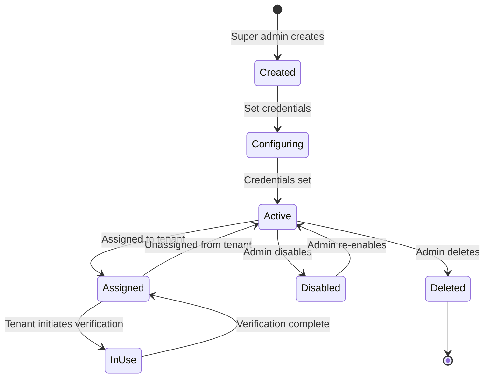

# Provider Management

## 🎯 Overview

Provider Management allows **super admins** to configure KYC verification providers **centrally** and assign them to tenants. 

**Key Change**: Credentials are now **provider-level** (managed once by super admin), not tenant-level. Tenants are simply **assigned** providers.

## 🔑 Key Concepts

### Centralized Provider Entity
```typescript
interface Provider {
  id: string;
  name: string;
  type: 'single_step' | 'multi_step' | 'async_webhook';
  
  // Centralized credentials (super admin only)
  api_key?: string;
  secret_key?: string;
  webhook_secret?: string; // HMAC for webhook signature verification
  
  // Configuration
  base_url: string;
  api_version?: string;
  
  // Capabilities
  supports_webhooks: boolean;
  supports_multi_step: boolean;
  supports_hosted_workflow: boolean;
  
  // Status
  is_active: boolean;
  
  // Additional config (timeouts, retries, etc.)
  config: {
    timeout: number;
    retryAttempts: number;
    [key: string]: any;
  };
  
  createdAt: Date;
  updatedAt: Date;
}
```

### Provider Assignment (Tenant-Level)
```typescript
interface TenantProviderAssignment {
  id: string;
  tenant_id: string;
  provider_id: string;
  
  // Assignment settings
  priority: number; // Lower = higher priority
  is_enabled: boolean;
  
  // Optional tenant-specific overrides (rarely used)
  tenant_overrides?: {
    custom_timeout?: number;
    custom_metadata?: any;
  };
  
  createdAt: Date;
  updatedAt: Date;
}
```

## 📋 Super Admin Operations

### 1. List All Providers

**Endpoint**: `GET /admin/providers`

**Response**:
```json
[
  {
    "id": "provider-uuid-1",
    "name": "IDmeta",
    "type": "multi_step",
    "base_url": "https://integrate.idmetagroup.com/api",
    "api_version": "v1",
    "webhook_endpoint": "/v1/webhook/idmeta",
    "webhook_secret_set": true,
    "api_key_set": true,
    "secret_key_set": true,
    "supports_webhooks": true,
    "is_active": true,
    "config": { "timeout": 30000, "retryAttempts": 3 }
  }
]
```

### 2. Get Single Provider (Full Credentials)

**Endpoint**: `GET /admin/providers/:providerId`

**Response**:
```json
{
  "id": "provider-uuid-1",
  "name": "IDmeta",
  "type": "multi_step",
  "base_url": "https://integrate.idmetagroup.com/api",
  "api_key": "pk_live_actual_key",
  "secret_key": "sk_live_actual_secret",
  "webhook_secret": "whsec_actual_hmac",
  "webhook_endpoint": "/v1/webhook/idmeta",
  "is_active": true
}
```

### 3. Update Provider (Set Credentials)

**Endpoint**: `PUT /admin/providers/:providerId`

**Request**:
```json
{
  "api_key": "pk_live_new_key",
  "secret_key": "sk_live_new_secret",
  "webhook_secret": "whsec_generated_hmac",
  "base_url": "https://api.provider.com",
  "config": { "timeout": 30000, "retryAttempts": 3 }
}
```

**Implementation**:
```typescript
@Put(':providerId')
@UseGuards(AdminAuthGuard)
async updateProvider(
  @Param('providerId') providerId: string,
  @Body() updateDto: UpdateProviderDto
) {
  const provider = await this.providerRepository.findOne({
    where: { id: providerId }
  });
  
  if (!provider) {
    throw new NotFoundException('Provider not found');
  }
  
  // Update centralized credentials
  if (updateDto.api_key) provider.api_key = updateDto.api_key;
  if (updateDto.secret_key) provider.secret_key = updateDto.secret_key;
  if (updateDto.webhook_secret) provider.webhook_secret = updateDto.webhook_secret;
  if (updateDto.base_url) provider.base_url = updateDto.base_url;
  
  // Merge config (don't overwrite existing keys)
  if (updateDto.config) {
    provider.config = { ...provider.config, ...updateDto.config };
  }
  
  await this.providerRepository.save(provider);
  
  // Audit log
  await this.auditLog.create({
    action: 'provider.updated',
    resourceId: provider.id,
    userId: adminId
  });
  
  return provider;
}
```

### 4. Assign Provider to Tenant

**Endpoint**: `POST /admin/tenants/:tenantId/providers/:providerId/assign`

**Request**:
```json
{
  "priority": 1
}
```

**Response**:
```json
{
  "assignment_id": "assignment-uuid",
  "tenant_id": "tenant-uuid",
  "provider": {
    "id": "provider-uuid",
    "name": "IDmeta",
    "type": "multi_step"
  },
  "priority": 1,
  "is_enabled": true
}
```

**Implementation**:
```typescript
@Post(':tenantId/providers/:providerId/assign')
@UseGuards(AdminAuthGuard)
async assignProvider(
  @Param('tenantId') tenantId: string,
  @Param('providerId') providerId: string,
  @Body() assignDto: { priority?: number }
) {
  // Verify tenant and provider exist
  const tenant = await this.tenantRepository.findOne({ where: { id: tenantId } });
  const provider = await this.providerRepository.findOne({ where: { id: providerId } });
  
  if (!tenant || !provider) {
    throw new NotFoundException('Tenant or provider not found');
  }
  
  // Check if already assigned
  const existing = await this.tenantProviderConfigRepository.findOne({
    where: { tenant_id: tenantId, provider_id: providerId }
  });
  
  if (existing) {
    throw new ConflictException('Provider already assigned to tenant');
  }
  
  // Create assignment (no credentials, just link)
  const assignment = await this.tenantProviderConfigRepository.save({
    tenant_id: tenantId,
    provider_id: providerId,
    priority: assignDto.priority || 1,
    is_enabled: true
  });
  
  // Audit log
  await this.auditLog.create({
    action: 'provider.assigned',
    resourceType: 'tenant',
    resourceId: tenantId,
    userId: adminId,
    changes: { providerId }
  });
  
  return assignment;
}
```

### 5. Get Tenant's Provider Assignments

**Endpoint**: `GET /admin/tenants/:tenantId/provider-assignments`

**Response**:
```json
[
  {
    "assignment_id": "assignment-uuid",
    "tenant_id": "tenant-uuid",
    "provider": {
      "id": "provider-uuid",
      "name": "IDmeta",
      "type": "multi_step",
      "webhook_endpoint": "/v1/webhook/idmeta"
    },
    "priority": 1,
    "is_enabled": true,
    "tenant_overrides": null
  }
]
```

### 6. Update Provider Assignment

**Endpoint**: `PUT /admin/tenants/:tenantId/provider-assignments/:assignmentId`

**Request**:
```json
{
  "priority": 2,
  "is_enabled": false
}
```

### 7. Remove Provider Assignment

**Endpoint**: `DELETE /admin/tenants/:tenantId/provider-assignments/:assignmentId`

## 🔄 Provider Lifecycle



## 🔐 Webhook Configuration

### Auto-Generated Webhook Endpoint

Each provider has a static webhook URL:
```
https://yourdomain.com/v1/webhook/{provider-name-slug}
```

**Example:**
- Provider: "IDmeta"
- Webhook URL: `https://yourdomain.com/v1/webhook/idmeta`

### Webhook Secret (HMAC)

Super admin generates and provides to the provider:

```typescript
// Generate secure webhook secret
const webhookSecret = crypto.randomBytes(32).toString('base64');

// Update provider
await updateProvider(providerId, {
  webhook_secret: webhookSecret
});

// Admin copies URL + secret to provider dashboard (e.g., IDmeta)
```

## 🔒 Security Considerations

### Credential Management
- **Centralized**: Credentials stored once at provider level
- **Super admin only**: Only super admins can view/edit credentials
- **Never logged**: Sensitive data never appears in logs
- **Encrypted at rest**: Database-level encryption recommended

### Access Control
- `super_admin` → Full provider management
- `tenant_admin` → View assigned providers (read-only, no credentials)
- `tenant_user` → Cannot access provider information

### Audit Trail
All provider operations are logged:
- `provider.created`
- `provider.updated`
- `provider.credentials_changed`
- `provider.assigned`
- `provider.unassigned`
- `provider.deleted`

## 🧪 Testing Provider Connection

**Endpoint**: `POST /admin/providers/:id/test`

**Implementation**:
```typescript
@Post(':id/test')
@UseGuards(AdminAuthGuard)
async testProvider(@Param('id') providerId: string) {
  const provider = await this.providerRepository.findOne({
    where: { id: providerId }
  });
  
  if (!provider) {
    throw new NotFoundException('Provider not found');
  }
  
  // Get provider instance
  const instance = await this.factory.getProviderById(providerId);
  
  // Initialize with centralized credentials
  await instance.initialize({
    apiKey: provider.api_key,
    secretKey: provider.secret_key,
    webhookSecret: provider.webhook_secret,
    baseUrl: provider.base_url
  }, {
    timeout: provider.config.timeout || 30000
  });
  
  // Test health check
  const startTime = Date.now();
  try {
    const health = await instance.healthCheck();
    const latency = Date.now() - startTime;
    
    return {
      success: true,
      healthy: health.isHealthy,
      latency,
      message: health.message
    };
  } catch (error) {
    return {
      success: false,
      error: error.message,
      latency: Date.now() - startTime
    };
  }
}
```

## 📊 Provider Statistics

Track provider performance:
- Total verifications
- Success rate
- Average processing time
- Error rate
- Uptime percentage

---

**Back to**: [[00-INDEX|Index]]

